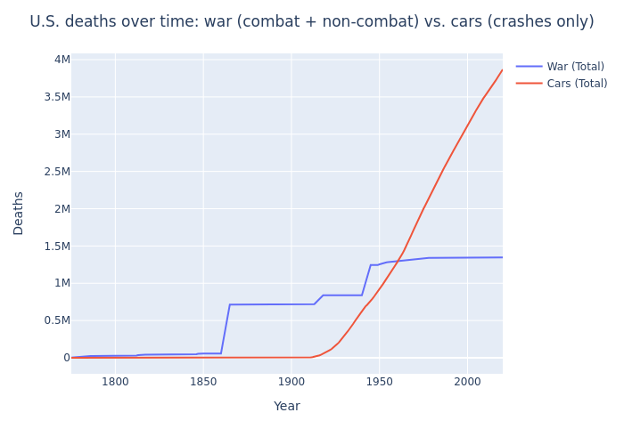

## Car crashes have killed 3x as many people in the US as all wars:
Sources:
- [Motor vehicle deaths in U.S. by year](https://en.wikipedia.org/wiki/Motor_vehicle_fatality_rate_in_U.S._by_year)
- [United States military casualties of war](https://en.wikipedia.org/wiki/United_States_military_casualties_of_war#Overview)



The code below generates this plot:


```python
from datetime import datetime as dt
from os.path import basename, exists
import pandas as pd
import plotly.express as px
import re
from urllib.request import urlretrieve
```

Helper for:
- scraping a URL (in this case, a Wikipedia article)
- caching it locally
- parsing any tables it contains
- returning the table at index `idx`


```python
def get_table(url, idx, path=None):
    if path is None:
        name = basename(url)
        path = f'{name}.html'
    if not exists(path):
        print(f'Downloading {url} to {path}')
        urlretrieve(url, path)
    tables = pd.read_html(path)
    table = tables[idx]
    return table
```

## 1. U.S. Motor Vehicle Fatalities <a id="cars"></a>
Pull table from Wikipedia article: [Motor vehicle deaths in U.S. by year](https://en.wikipedia.org/wiki/Motor_vehicle_fatality_rate_in_U.S._by_year)


```python
cars_url = 'https://en.wikipedia.org/wiki/Motor_vehicle_fatality_rate_in_U.S._by_year'
cars_path = 'Motor_vehicle_fatality_rate_in_U.S._by_year.html'
cars = get_table(cars_url, idx=0)
cars
```


<div>
<style scoped>
    .dataframe tbody tr th:only-of-type {
        vertical-align: middle;
    }

    .dataframe tbody tr th {
        vertical-align: top;
    }

    .dataframe thead th {
        text-align: right;
    }
</style>
<table border="1" class="dataframe">
  <thead>
    <tr style="text-align: right;">
      <th></th>
      <th>Year</th>
      <th>Deaths</th>
      <th>VMT– Vehicle miles traveled (billions)</th>
      <th>Fatalities per 100 million VMT</th>
      <th>Population</th>
      <th>Fatalities per 100,000 population</th>
      <th>Change in per capita fatalities from previous year</th>
    </tr>
  </thead>
  <tbody>
    <tr>
      <th>0</th>
      <td>1899</td>
      <td>26[5]</td>
      <td>NaN</td>
      <td>NaN</td>
      <td>NaN</td>
      <td>NaN</td>
      <td>NaN</td>
    </tr>
    <tr>
      <th>1</th>
      <td>1900</td>
      <td>36</td>
      <td>NaN</td>
      <td>NaN</td>
      <td>76094000.0</td>
      <td>0.05</td>
      <td>NaN</td>
    </tr>
    <tr>
      <th>2</th>
      <td>1901</td>
      <td>54</td>
      <td>NaN</td>
      <td>NaN</td>
      <td>77584000.0</td>
      <td>0.07</td>
      <td>47.1%</td>
    </tr>
    <tr>
      <th>3</th>
      <td>1902</td>
      <td>79</td>
      <td>NaN</td>
      <td>NaN</td>
      <td>79163000.0</td>
      <td>0.10</td>
      <td>43.4%</td>
    </tr>
    <tr>
      <th>4</th>
      <td>1903</td>
      <td>117</td>
      <td>NaN</td>
      <td>NaN</td>
      <td>80632000.0</td>
      <td>0.15</td>
      <td>45.4%</td>
    </tr>
    <tr>
      <th>...</th>
      <td>...</td>
      <td>...</td>
      <td>...</td>
      <td>...</td>
      <td>...</td>
      <td>...</td>
      <td>...</td>
    </tr>
    <tr>
      <th>116</th>
      <td>2015</td>
      <td>35485</td>
      <td>3095.0</td>
      <td>1.15</td>
      <td>321370000.0</td>
      <td>11.06</td>
      <td>7.6%</td>
    </tr>
    <tr>
      <th>117</th>
      <td>2016[8]</td>
      <td>37806</td>
      <td>3174.0</td>
      <td>1.19</td>
      <td>323121000.0</td>
      <td>11.59</td>
      <td>4.8%</td>
    </tr>
    <tr>
      <th>118</th>
      <td>2017[8][9]</td>
      <td>37473</td>
      <td>3213.0</td>
      <td>1.16</td>
      <td>326213213.0</td>
      <td>11.40</td>
      <td>-1.6%</td>
    </tr>
    <tr>
      <th>119</th>
      <td>2018[9][10]</td>
      <td>36560</td>
      <td>3223.0</td>
      <td>1.13</td>
      <td>327096265.0</td>
      <td>11.18</td>
      <td>-1.9%</td>
    </tr>
    <tr>
      <th>120</th>
      <td>2019[11][12]</td>
      <td>36120</td>
      <td>NaN</td>
      <td>1.10</td>
      <td>NaN</td>
      <td>NaN</td>
      <td>-1.2%</td>
    </tr>
  </tbody>
</table>
<p>121 rows × 7 columns</p>
</div>


### Clean data:
- remove citation brackets
- convert data types, index by year
- add 2020 stat (38,360; [source](https://www.usnews.com/news/health-news/articles/2021-06-04/traffic-deaths-increased-in-2020-despite-fewer-people-on-roads-during-pandemic))


```python
for k in cars:
    if cars[k].dtype == 'object':
        cars[k] = cars[k].str.replace('(?: ?\[\d+\])+$', '')
cars = (
    cars
    .astype({'Year': int, 'Deaths': int})
    .set_index('Year')
    .Deaths
)
cars.loc[2020] = 38360
cars
```


    Year
    1899       26
    1900       36
    1901       54
    1902       79
    1903      117
            ...  
    2016    37806
    2017    37473
    2018    36560
    2019    36120
    2020    38360
    Name: Deaths, Length: 122, dtype: int64


## 2. U.S. casualties of war  <a id="wars"></a>
Pull table from Wikipedia article: [United States military casualties of war](https://en.wikipedia.org/wiki/United_States_military_casualties_of_war#Overview)


```python
wars_url = 'https://en.wikipedia.org/wiki/United_States_military_casualties_of_war'
wars_path = 'United_States_military_casualties_of_war.html'
wars = get_table(wars_url, idx=0)
wars
```


<div>
<style scoped>
    .dataframe tbody tr th:only-of-type {
        vertical-align: middle;
    }

    .dataframe tbody tr th {
        vertical-align: top;
    }

    .dataframe thead tr th {
        text-align: left;
    }
</style>
<table border="1" class="dataframe">
  <thead>
    <tr>
      <th></th>
      <th>War or conflict</th>
      <th>Date</th>
      <th colspan="3" halign="left">Total U.S. deaths</th>
      <th>Wounded</th>
      <th>Total U.S. casualties</th>
      <th>Missing</th>
      <th>Sources and notes</th>
      <th>Deaths as percentage of total population</th>
    </tr>
    <tr>
      <th></th>
      <th>War or conflict</th>
      <th>Date</th>
      <th>Combat</th>
      <th>Other</th>
      <th>Total</th>
      <th>Wounded</th>
      <th>Total U.S. casualties</th>
      <th>Missing</th>
      <th>Sources and notes</th>
      <th>Deaths as percentage of total population</th>
    </tr>
  </thead>
  <tbody>
    <tr>
      <th>0</th>
      <td>American Revolutionary War</td>
      <td>1775–1783</td>
      <td>8000</td>
      <td>17000</td>
      <td>25000</td>
      <td>25000</td>
      <td>50000</td>
      <td>NaN</td>
      <td>NaN</td>
      <td>NaN</td>
    </tr>
    <tr>
      <th>1</th>
      <td>Northwest Indian War</td>
      <td>1785–1796</td>
      <td>1,056+</td>
      <td>NaN</td>
      <td>1,056+</td>
      <td>825+</td>
      <td>1,881+</td>
      <td>NaN</td>
      <td>[1][2][3]</td>
      <td>NaN</td>
    </tr>
    <tr>
      <th>2</th>
      <td>Quasi-War</td>
      <td>1798–1800</td>
      <td>20</td>
      <td>494[4]</td>
      <td>514</td>
      <td>42</td>
      <td>556</td>
      <td>NaN</td>
      <td>[4][5]</td>
      <td>NaN</td>
    </tr>
    <tr>
      <th>3</th>
      <td>First Barbary War</td>
      <td>1801–1805</td>
      <td>35</td>
      <td>39</td>
      <td>74</td>
      <td>64</td>
      <td>138</td>
      <td>NaN</td>
      <td>[6][7]: 25–27 [8][9]</td>
      <td>NaN</td>
    </tr>
    <tr>
      <th>4</th>
      <td>Other actions against pirates</td>
      <td>1800–1900</td>
      <td>36</td>
      <td>158+[7]: 42</td>
      <td>194+</td>
      <td>100+</td>
      <td>294+</td>
      <td>NaN</td>
      <td>[5][10][11][b]</td>
      <td>NaN</td>
    </tr>
    <tr>
      <th>...</th>
      <td>...</td>
      <td>...</td>
      <td>...</td>
      <td>...</td>
      <td>...</td>
      <td>...</td>
      <td>...</td>
      <td>...</td>
      <td>...</td>
      <td>...</td>
    </tr>
    <tr>
      <th>77</th>
      <td>War in Afghanistan</td>
      <td>2001-2021</td>
      <td>1,833 [83]</td>
      <td>385[84][83]</td>
      <td>2218</td>
      <td>20,093[83]</td>
      <td>22311</td>
      <td>NaN</td>
      <td>[f][83][84]</td>
      <td>NaN</td>
    </tr>
    <tr>
      <th>78</th>
      <td>Iraq War</td>
      <td>2003–2011</td>
      <td>3,836*</td>
      <td>961</td>
      <td>4497</td>
      <td>32222</td>
      <td>36710</td>
      <td>3</td>
      <td>[83]</td>
      <td>NaN</td>
    </tr>
    <tr>
      <th>79</th>
      <td>Intervention against the Islamic State of Iraq...</td>
      <td>2014–present</td>
      <td>16</td>
      <td>60</td>
      <td>76</td>
      <td>81</td>
      <td>157</td>
      <td>NaN</td>
      <td>[83]</td>
      <td>NaN</td>
    </tr>
    <tr>
      <th>80</th>
      <td>Raid on Yemen</td>
      <td>2017</td>
      <td>1</td>
      <td>NaN</td>
      <td>1</td>
      <td>3</td>
      <td>4</td>
      <td>NaN</td>
      <td>[85]</td>
      <td>NaN</td>
    </tr>
    <tr>
      <th>81</th>
      <td>Total</td>
      <td>1775–2019</td>
      <td>666,441+</td>
      <td>673,929+</td>
      <td>1,354,664+</td>
      <td>1,498,240+</td>
      <td>2,852,901+</td>
      <td>40,031+</td>
      <td>NaN</td>
      <td>NaN</td>
    </tr>
  </tbody>
</table>
<p>82 rows × 10 columns</p>
</div>


### Clean data
- flatten column index
- scrub citation brackets and trailing `~`/`+` characters
- convert to numbers, drop na's, fill in "present" to be the current year


```python
wars.columns = [ col[1] for col in wars.columns ]  # Flatten column index
for k in wars:
    if wars[k].dtype == 'object':
        wars[k] = wars[k].str.replace('(?: ?\[\d+\](?:\:\s?\d+(?:-\d+)?)?)+$', '')
        wars[k] = wars[k].str.replace('[~+]$', '')


wars = wars.rename(columns={'War or conflict': 'War'}).set_index('War')[['Date','Total']]
wars = wars.dropna(subset=['Date', 'Total'], how='any')
wars.Total = wars.Total.str.replace(',', '')
year = dt.now().year
wars.Date = wars.Date.str.replace('present', str(year))
wars
```


<div>
<style scoped>
    .dataframe tbody tr th:only-of-type {
        vertical-align: middle;
    }

    .dataframe tbody tr th {
        vertical-align: top;
    }

    .dataframe thead th {
        text-align: right;
    }
</style>
<table border="1" class="dataframe">
  <thead>
    <tr style="text-align: right;">
      <th></th>
      <th>Date</th>
      <th>Total</th>
    </tr>
    <tr>
      <th>War</th>
      <th></th>
      <th></th>
    </tr>
  </thead>
  <tbody>
    <tr>
      <th>American Revolutionary War</th>
      <td>1775–1783</td>
      <td>25000</td>
    </tr>
    <tr>
      <th>Northwest Indian War</th>
      <td>1785–1796</td>
      <td>1056</td>
    </tr>
    <tr>
      <th>Quasi-War</th>
      <td>1798–1800</td>
      <td>514</td>
    </tr>
    <tr>
      <th>First Barbary War</th>
      <td>1801–1805</td>
      <td>74</td>
    </tr>
    <tr>
      <th>Other actions against pirates</th>
      <td>1800–1900</td>
      <td>194</td>
    </tr>
    <tr>
      <th>...</th>
      <td>...</td>
      <td>...</td>
    </tr>
    <tr>
      <th>War in Afghanistan</th>
      <td>2001-2021</td>
      <td>2218</td>
    </tr>
    <tr>
      <th>Iraq War</th>
      <td>2003–2011</td>
      <td>4497</td>
    </tr>
    <tr>
      <th>Intervention against the Islamic State of Iraq and Syria</th>
      <td>2014–2021</td>
      <td>76</td>
    </tr>
    <tr>
      <th>Raid on Yemen</th>
      <td>2017</td>
      <td>1</td>
    </tr>
    <tr>
      <th>Total</th>
      <td>1775–2019</td>
      <td>1354664</td>
    </tr>
  </tbody>
</table>
<p>77 rows × 2 columns</p>
</div>


Parse dates into start and end years, and numeric casualty ranges into `lo` and `hi` estimates


```python
def parse_ints(years, min_key, max_key):
    matches = re.findall('\d+', years)
    years = [ int(year) for year in matches ]
    m = min(years)
    M = max(years)
    return {min_key: m, max_key: M}

wars = pd.concat(
    [
        wars, 
        wars['Date'].apply(parse_ints, min_key='start', max_key='end').apply(pd.Series),
        wars['Total'].apply(parse_ints, min_key='lo', max_key='hi').apply(pd.Series),
    ],
    axis=1,
)
wars
```


<div>
<style scoped>
    .dataframe tbody tr th:only-of-type {
        vertical-align: middle;
    }

    .dataframe tbody tr th {
        vertical-align: top;
    }

    .dataframe thead th {
        text-align: right;
    }
</style>
<table border="1" class="dataframe">
  <thead>
    <tr style="text-align: right;">
      <th></th>
      <th>Date</th>
      <th>Total</th>
      <th>start</th>
      <th>end</th>
      <th>lo</th>
      <th>hi</th>
    </tr>
    <tr>
      <th>War</th>
      <th></th>
      <th></th>
      <th></th>
      <th></th>
      <th></th>
      <th></th>
    </tr>
  </thead>
  <tbody>
    <tr>
      <th>American Revolutionary War</th>
      <td>1775–1783</td>
      <td>25000</td>
      <td>1775</td>
      <td>1783</td>
      <td>25000</td>
      <td>25000</td>
    </tr>
    <tr>
      <th>Northwest Indian War</th>
      <td>1785–1796</td>
      <td>1056</td>
      <td>1785</td>
      <td>1796</td>
      <td>1056</td>
      <td>1056</td>
    </tr>
    <tr>
      <th>Quasi-War</th>
      <td>1798–1800</td>
      <td>514</td>
      <td>1798</td>
      <td>1800</td>
      <td>514</td>
      <td>514</td>
    </tr>
    <tr>
      <th>First Barbary War</th>
      <td>1801–1805</td>
      <td>74</td>
      <td>1801</td>
      <td>1805</td>
      <td>74</td>
      <td>74</td>
    </tr>
    <tr>
      <th>Other actions against pirates</th>
      <td>1800–1900</td>
      <td>194</td>
      <td>1800</td>
      <td>1900</td>
      <td>194</td>
      <td>194</td>
    </tr>
    <tr>
      <th>...</th>
      <td>...</td>
      <td>...</td>
      <td>...</td>
      <td>...</td>
      <td>...</td>
      <td>...</td>
    </tr>
    <tr>
      <th>War in Afghanistan</th>
      <td>2001-2021</td>
      <td>2218</td>
      <td>2001</td>
      <td>2021</td>
      <td>2218</td>
      <td>2218</td>
    </tr>
    <tr>
      <th>Iraq War</th>
      <td>2003–2011</td>
      <td>4497</td>
      <td>2003</td>
      <td>2011</td>
      <td>4497</td>
      <td>4497</td>
    </tr>
    <tr>
      <th>Intervention against the Islamic State of Iraq and Syria</th>
      <td>2014–2021</td>
      <td>76</td>
      <td>2014</td>
      <td>2021</td>
      <td>76</td>
      <td>76</td>
    </tr>
    <tr>
      <th>Raid on Yemen</th>
      <td>2017</td>
      <td>1</td>
      <td>2017</td>
      <td>2017</td>
      <td>1</td>
      <td>1</td>
    </tr>
    <tr>
      <th>Total</th>
      <td>1775–2019</td>
      <td>1354664</td>
      <td>1775</td>
      <td>2019</td>
      <td>1354664</td>
      <td>1354664</td>
    </tr>
  </tbody>
</table>
<p>77 rows × 6 columns</p>
</div>


Use the low-end estimates, drop final "total" row


```python
wars = (
    wars
    .iloc[:-1]
    .copy()
    [['start', 'end', 'lo']]
    .rename(columns={'lo': 'deaths'})
    .sort_values('end')
)
wars
```


<div>
<style scoped>
    .dataframe tbody tr th:only-of-type {
        vertical-align: middle;
    }

    .dataframe tbody tr th {
        vertical-align: top;
    }

    .dataframe thead th {
        text-align: right;
    }
</style>
<table border="1" class="dataframe">
  <thead>
    <tr style="text-align: right;">
      <th></th>
      <th>start</th>
      <th>end</th>
      <th>deaths</th>
    </tr>
    <tr>
      <th>War</th>
      <th></th>
      <th></th>
      <th></th>
    </tr>
  </thead>
  <tbody>
    <tr>
      <th>American Revolutionary War</th>
      <td>1775</td>
      <td>1783</td>
      <td>25000</td>
    </tr>
    <tr>
      <th>Northwest Indian War</th>
      <td>1785</td>
      <td>1796</td>
      <td>1056</td>
    </tr>
    <tr>
      <th>Quasi-War</th>
      <td>1798</td>
      <td>1800</td>
      <td>514</td>
    </tr>
    <tr>
      <th>First Barbary War</th>
      <td>1801</td>
      <td>1805</td>
      <td>74</td>
    </tr>
    <tr>
      <th>Chesapeake–Leopard affair</th>
      <td>1807</td>
      <td>1807</td>
      <td>3</td>
    </tr>
    <tr>
      <th>...</th>
      <td>...</td>
      <td>...</td>
      <td>...</td>
    </tr>
    <tr>
      <th>Iraq War</th>
      <td>2003</td>
      <td>2011</td>
      <td>4497</td>
    </tr>
    <tr>
      <th>Raid on Yemen</th>
      <td>2017</td>
      <td>2017</td>
      <td>1</td>
    </tr>
    <tr>
      <th>Colombia</th>
      <td>1994</td>
      <td>2021</td>
      <td>8</td>
    </tr>
    <tr>
      <th>War in Afghanistan</th>
      <td>2001</td>
      <td>2021</td>
      <td>2218</td>
    </tr>
    <tr>
      <th>Intervention against the Islamic State of Iraq and Syria</th>
      <td>2014</td>
      <td>2021</td>
      <td>76</td>
    </tr>
  </tbody>
</table>
<p>76 rows × 3 columns</p>
</div>


Approximate each war's deaths as being evenly spread over the years in which the war was waged:


```python
def spread_war(r):
    start, end, deaths = r['start'], r['end'], r['deaths']
    years = range(start, end + 1)
    num_years = len(years)
    deaths_per_year = deaths / num_years
    return [ dict(war_deaths=deaths_per_year, year=year) for year in years ]

war_deaths_per_year = (
    wars
    .apply(spread_war, axis=1)
    .explode()
    .apply(pd.Series)
    .astype({'year': int})
    .reset_index()
    .groupby('year')
    .sum()
)
war_deaths_per_year
```


<div>
<style scoped>
    .dataframe tbody tr th:only-of-type {
        vertical-align: middle;
    }

    .dataframe tbody tr th {
        vertical-align: top;
    }

    .dataframe thead th {
        text-align: right;
    }
</style>
<table border="1" class="dataframe">
  <thead>
    <tr style="text-align: right;">
      <th></th>
      <th>war_deaths</th>
    </tr>
    <tr>
      <th>year</th>
      <th></th>
    </tr>
  </thead>
  <tbody>
    <tr>
      <th>1775</th>
      <td>2777.777778</td>
    </tr>
    <tr>
      <th>1776</th>
      <td>2777.777778</td>
    </tr>
    <tr>
      <th>1777</th>
      <td>2777.777778</td>
    </tr>
    <tr>
      <th>1778</th>
      <td>2777.777778</td>
    </tr>
    <tr>
      <th>1779</th>
      <td>2777.777778</td>
    </tr>
    <tr>
      <th>...</th>
      <td>...</td>
    </tr>
    <tr>
      <th>2017</th>
      <td>116.404762</td>
    </tr>
    <tr>
      <th>2018</th>
      <td>115.404762</td>
    </tr>
    <tr>
      <th>2019</th>
      <td>115.404762</td>
    </tr>
    <tr>
      <th>2020</th>
      <td>115.404762</td>
    </tr>
    <tr>
      <th>2021</th>
      <td>115.404762</td>
    </tr>
  </tbody>
</table>
<p>239 rows × 1 columns</p>
</div>


## 3. Combine per-year car and war deaths  <a id="combine"></a>


```python
deaths_per_year = pd.concat(
    [
        war_deaths_per_year['war_deaths'].rename('War'),
        cars.rename('Cars'),
    ],
    axis=1,
)
deaths_per_year
```


<div>
<style scoped>
    .dataframe tbody tr th:only-of-type {
        vertical-align: middle;
    }

    .dataframe tbody tr th {
        vertical-align: top;
    }

    .dataframe thead th {
        text-align: right;
    }
</style>
<table border="1" class="dataframe">
  <thead>
    <tr style="text-align: right;">
      <th></th>
      <th>War</th>
      <th>Cars</th>
    </tr>
  </thead>
  <tbody>
    <tr>
      <th>1775</th>
      <td>2777.777778</td>
      <td>NaN</td>
    </tr>
    <tr>
      <th>1776</th>
      <td>2777.777778</td>
      <td>NaN</td>
    </tr>
    <tr>
      <th>1777</th>
      <td>2777.777778</td>
      <td>NaN</td>
    </tr>
    <tr>
      <th>1778</th>
      <td>2777.777778</td>
      <td>NaN</td>
    </tr>
    <tr>
      <th>1779</th>
      <td>2777.777778</td>
      <td>NaN</td>
    </tr>
    <tr>
      <th>...</th>
      <td>...</td>
      <td>...</td>
    </tr>
    <tr>
      <th>2017</th>
      <td>116.404762</td>
      <td>37473.0</td>
    </tr>
    <tr>
      <th>2018</th>
      <td>115.404762</td>
      <td>36560.0</td>
    </tr>
    <tr>
      <th>2019</th>
      <td>115.404762</td>
      <td>36120.0</td>
    </tr>
    <tr>
      <th>2020</th>
      <td>115.404762</td>
      <td>38360.0</td>
    </tr>
    <tr>
      <th>2021</th>
      <td>115.404762</td>
      <td>NaN</td>
    </tr>
  </tbody>
</table>
<p>245 rows × 2 columns</p>
</div>


Fill in missing years, add cumulative sums


```python
start, end = deaths_per_year.index.min(), deaths_per_year.index.max()
years = pd.Index(range(start, min(2020, end) + 1), name='year')
deaths = years.to_frame().merge(deaths_per_year, left_index=True, right_index=True)[['War', 'Cars']].fillna(0)
deaths['War (Total)'] = deaths['War'].cumsum()
deaths['Cars (Total)'] = deaths['Cars'].cumsum()
deaths
```


<div>
<style scoped>
    .dataframe tbody tr th:only-of-type {
        vertical-align: middle;
    }

    .dataframe tbody tr th {
        vertical-align: top;
    }

    .dataframe thead th {
        text-align: right;
    }
</style>
<table border="1" class="dataframe">
  <thead>
    <tr style="text-align: right;">
      <th></th>
      <th>War</th>
      <th>Cars</th>
      <th>War (Total)</th>
      <th>Cars (Total)</th>
    </tr>
  </thead>
  <tbody>
    <tr>
      <th>1775</th>
      <td>2777.777778</td>
      <td>0.0</td>
      <td>2.777778e+03</td>
      <td>0.0</td>
    </tr>
    <tr>
      <th>1776</th>
      <td>2777.777778</td>
      <td>0.0</td>
      <td>5.555556e+03</td>
      <td>0.0</td>
    </tr>
    <tr>
      <th>1777</th>
      <td>2777.777778</td>
      <td>0.0</td>
      <td>8.333333e+03</td>
      <td>0.0</td>
    </tr>
    <tr>
      <th>1778</th>
      <td>2777.777778</td>
      <td>0.0</td>
      <td>1.111111e+04</td>
      <td>0.0</td>
    </tr>
    <tr>
      <th>1779</th>
      <td>2777.777778</td>
      <td>0.0</td>
      <td>1.388889e+04</td>
      <td>0.0</td>
    </tr>
    <tr>
      <th>...</th>
      <td>...</td>
      <td>...</td>
      <td>...</td>
      <td>...</td>
    </tr>
    <tr>
      <th>2016</th>
      <td>115.404762</td>
      <td>37806.0</td>
      <td>1.345876e+06</td>
      <td>3720188.0</td>
    </tr>
    <tr>
      <th>2017</th>
      <td>116.404762</td>
      <td>37473.0</td>
      <td>1.345992e+06</td>
      <td>3757661.0</td>
    </tr>
    <tr>
      <th>2018</th>
      <td>115.404762</td>
      <td>36560.0</td>
      <td>1.346108e+06</td>
      <td>3794221.0</td>
    </tr>
    <tr>
      <th>2019</th>
      <td>115.404762</td>
      <td>36120.0</td>
      <td>1.346223e+06</td>
      <td>3830341.0</td>
    </tr>
    <tr>
      <th>2020</th>
      <td>115.404762</td>
      <td>38360.0</td>
      <td>1.346339e+06</td>
      <td>3868701.0</td>
    </tr>
  </tbody>
</table>
<p>244 rows × 4 columns</p>
</div>


## 4. Plot <a id="plot"></a>


```python
fig = px.line(
    deaths[['War (Total)', 'Cars (Total)']],
    labels={
        'variable': '',
        'value': 'Deaths',
        'index': 'Year',
    }
)
fig.update_layout(
    title='U.S. deaths over time: war (combat + non-combat) vs. cars (crashes only)', title_x=0.5
)
fig
```


```python
fig.write_image('car_war_deaths.png')
```


